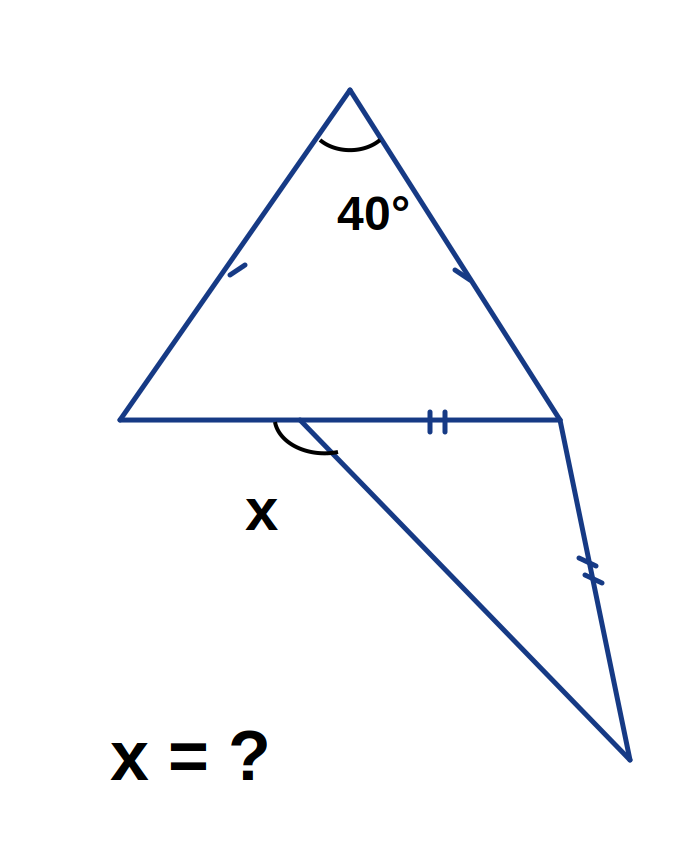

# Geometry Puzzle Book Blueprint

## Concept Overview
1. **Book Vision**: Build a progression from simple geometry puzzles to reasoning-heavy tasks.
2. **Audience**: Students (11-16), puzzle fans, teachers, and parents.
3. **Chapter Plan**: Warm-up, shape logic, strategy/proof-lite, challenge arena.
4. **Puzzle Format**: Difficulty tag, image, concise English task, optional hints, full solution section.
5. **Design**: High contrast visuals, one puzzle per page, consistent symbols.

## Puzzle 1 (English prompt)
In the figure, the top triangle is isosceles and the apex angle is **40°**.
Segments marked with identical tick marks are equal in length.
Determine the value of **x**.

